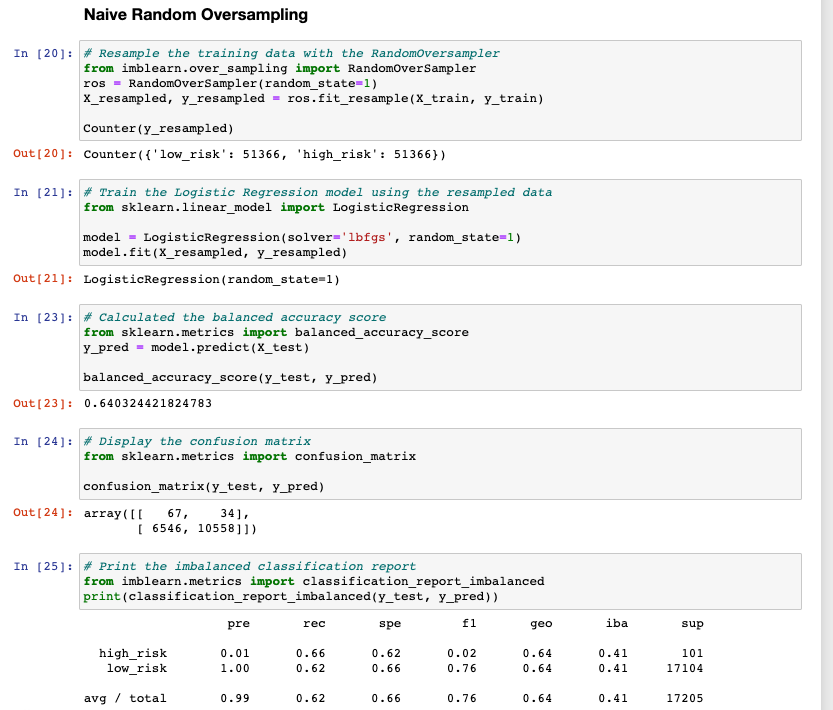

# Credit_Risk_Analysis
## Overview
The purpose of this machine learning script is to create a model that will help predict credit risk of individuals based on factors including (but not limited to) income, single/joint application, interest rate, last payment amount, etc. The sample size is imbalanced between those of high-risk and low-risk, which can create a bias toward the majority. For this reason, resampling is introducted to create a more balanced sample from each group. Three methods are utilized to evaluate the model's success: accuracy score, confusion matrix, and classification report.
## Results
### Naive Random Oversampling

- Balanced Accuracy Score = 0.64 (model correctly predicted outcome 64% of time)
- Low precision in predicting high-risk (0.01), high precision in predicting low-risk (1.00).
- Similar recall/sensitivity for both high-risk (0.66) and low-risk (0.62). 
### SMOTE Oversampling

- Balanced Accuracy Score = 0.65 (model correctly predicted outcome 65% of time)
- Low precision score in predicting high risk (0.01), high precision in predicting low-risk (1.0)
- Similar recall/sensitivity scores for high-risk (0.61) and low-risk (0.69)
### Undersampling

- Balanced Accuracy Score = 0.55 (model correctly predicted outcome only 55% of time)
- Low precision score in predicting high risk (0.01), high precision in predicting low-risk (1.0)
- Higher sensitivty/recall to high risk predictions (0.68) compared to low-risk (0.41)
### Combination (Over and Under) Sampling

- Balanced Accuracy Score = 0.66 (model correctly predicted outcome 66% of time)
- Low precision score in predicting high-risk (0.1) compared to high precision for low-risk (1.0)
- Higher sensitivity to high-risk incidents (0.75) compared to low-risk (0.56)
### Balanced Random Forest Classifier

- Balanced Accuracy Score = 0.79 
- Low precision score in predicting high-risk (0.03) versus low-risk (1.0)
- Similar sensitivity/recall for both high-risk (0.70) and low-risk (0.87)
### Easy Ensemble AdaBoost Classifier

- Balanced Accuracy Score = 0.92
- Low precision score in predicting high risk (0.05) versus low-risk (1.0)
- Similarly high recall/sensitivity for high-risk (0.93) and low-risk (0.9)
## Summary
An ideal model in this circumstance is one with high sensitivity to high-risk cases in order to capture as many potentially high-risk cases as possible (similar to screening for cancer, this could flag for a need for further inspection). In the same sense, an ideal model would also include high precision for low-risk cases in order to effectively consider the factors that contribute to one being low-risk. A high balanced accuracy score would also be a significant factor since it measures the percentage of accurate predictions the model is able to make. 
Based on this criteria, the Easy Ensemble AdaBoost Classifier since it demonstrated the highest sensitivity to high-risk instances (0.93) and the highest balanced accuracy (92%). All the models evaluated included a high precision score for low-risk instances so this would not be a factor when comparing these 6 models. Based on these evaluation results, Easy Ensemble AdaBoost Classifier could be recommended if it met the needs of the organization. The organization should determine the level of accuracy that would be acceptable before determining if a model fit those requirements. 
